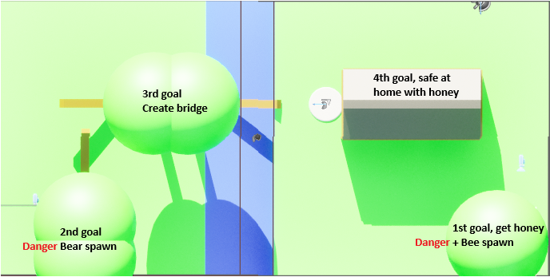

**Working title**
# Steal the honeycomb

1. **Threats**: Are follow player AI Agents in Unreal (tyrant)
2. **Win** condition: Get honeycomb into house
3. **Loss** condition: player gets stung by the bee or mauled by the bear

## Formal Elements
1. **Players**: 1 player
2. **Objective**: carry honeycomb to house
3. **Procedures**: Players can move, jump, and change direction (look). They need to navigate around trees, through a river, and a cabin.
4. **Rules**: Can't move through most other objects (water can be moved through).
5. **Resources**: collecting the honeycomb grants access to the river. Objects beyond the river cause the door on the cabin to disappear. Going in the cabin causes win condition.
6. **Conflict**: Knocking over a log to create a bridge is required to get to the cabin. The bear has to be activated to knock over trees.
7. **Boundaries**: Digital game using Windows PC monitor for output. Speakers for audio. keyboard and mouse input.

## Dramatic Elements
1. **Challenge**: Low challenge. Someone with basic familiarity of WASD based games should be able to beat the game in under 5 minutes.
2. **Premise**: The player wants honey in their oatmeal. They recall a beehive outside within walking distance.
3. **Character**: A hungry for honey flavored porridge robotic human
4. **Story**: You've been eating some porridge. It's not near as delicious as you'd hoped. It needs honey. bad. You recall there's a bee hive just off to the side of your home. Your goal is to bring some honey home to mix into your porridge.
5. **Game events**
   1. Talking bubble shows "This porrigde needs honey. bad." over a small cabin in the woods.
   2. SKIP ~~Humanoid comes out of the hut and controls show up on the screen.~~
   3. SKIP ~~Controls are dismissed as they are pressed by the player.~~
   4. Humanoid eventually collides with the honeycomb.
   5. Humanoid eventually escapes water-hating bee.
   6. Humanoid eventually releases the bear.
   7. Humanoid eventually guides the bear to collide with the log, knocking it over and creating a bridge over the creek.
   8. Humanoid either collides with home => win, or collides with bee/bear => loses
   9. UI comes up to replay the game
6. **World Building**: Use Epic's `StartContent/Architecture` modular pack with a palette of solid color materials for a cabin in the forest vibe.
7. **Dramatic Tension**: Bear chases player

## Map

## Character movement
Feel design intents:
1. Player: crispy and familiar
2. Bee: Floaty
3. Bear: Heavy

### Bee:
1. Gravity 1 => 0.5
2. Mass 100 => 10

### Bear:
1. SKIP ~~Intermediately charging.~~
2. Max Walk Speed: 500cm/s => 2500
3. Max Acceleration: 1500 => 2000
4. Braking Deceleration Walking: 2000 => 10
5. Ground Friction: 8 => 16
6. SKIP ~~Rotation Rate (Yaw): 500 => 5 (this causes the movement to bug out. Likely going to ignore this setting instead of finding a fix)~~
7. Capsule Radius: 35 => 80 (This causes MoveTo to fail to A* to a path where its collider can fit. Don't take the time to fix, so need simplified levels.)
